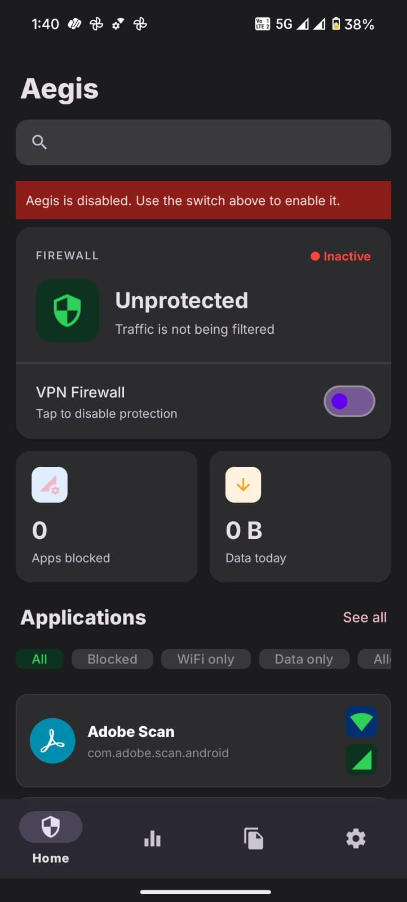
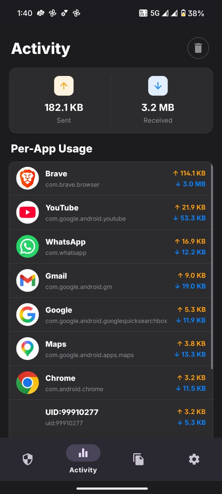
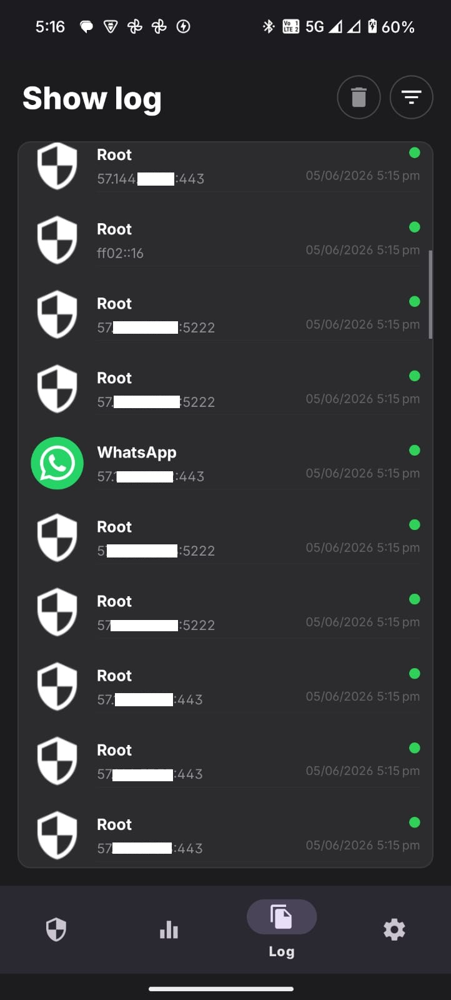
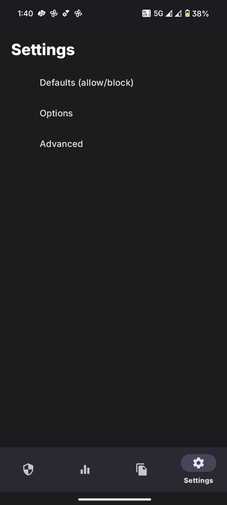

<div align="center">


# AEGIS

**A lightweight, privacy-focused firewall for Android  no root required.**

[](https://android.com)
[](https://openjdk.org)
[](https://m3.material.io)
[](LICENSE)

</div>

---

AEGIS gives you full visibility and control over every app's network access on your Android device. It intercepts traffic at the VPN layer — no root, no system modifications, no cloud dependency. Everything runs locally on your device.

---
## Current Status

🚧 Alpha 🚧

#### Current Stage: Alpha

AEGIS is actively developed and the core networking stack is functional. The application currently supports VPN-based traffic interception, native packet processing through JNI, per-app firewall enforcement, real-time logging, and local SQLite persistence.

Current development focuses on performance, reliability, enhanced filtering and analysis capabilities, and additional quality-of-life features.

### Implemented
- [x] Local VPN tunnel using Android VpnService
- [x] Per-app firewall rules
- [x] Real-time packet logging
- [x] Network usage tracking
- [x] SQLite persistence
- [x] Material 3 UI
- [x] JNI integration with native packet engine
- [x] On-device spyware and stalkerware detection & response

### In Progress
- [ ] Performance optimization
- [ ] UI refinement
- [ ] Stability testing
- [ ] Additional filtering capabilities


## Screenshots

<p align="center">
  
  
</p>

<p align="center">
  
  
</p>

---

## Features

### 🔒 Per-app Firewall Rules
Block or allow network access individually for every installed app system apps included. Rules persist across reboots and VPN restarts.

### 📋 Live Activity Log
Every packet flowing through the tunnel is captured and displayed in real time  destination domain or IP, app name, port, direction, timestamp, and allow/block status.

### 📊 Network Usage Tracking
Monitor how much data each app sends and receives over time. Per-app usage is tracked by the native packet engine and stored locally in SQLite.

### 🔍 App Detail View
Tap any app to inspect its full connection history  every destination it has contacted, the protocol used, and the bytes exchanged.

### 🕵️ Spyware & Stalkerware Detection
On-device scanner combining known signature matching with behavioral heuristics (hidden launcher icons, active device admin privileges, accessibility services, sideloaded install sources). Features instant per-app firewall network blocking and assisted uninstaller handoff.

### ⚙️ Simple Settings
Configure default block policy (whitelist or blacklist mode), toggle logging, and adjust behavior for Wi-Fi vs mobile data independently.

### 🎨 Material 3 Dark UI
Clean, minimal interface built on Material 3 with a dark-first design, optimised for one-handed daily use.

---

## How it Works

AEGIS creates a local VPN tunnel using Android's [`VpnService`](https://developer.android.com/reference/android/net/VpnService) API. All device traffic is routed through this tunnel, where a native packet engine written in C (`libaegiscore`) inspects each packet and makes an allow/block decision based on your configured rules.

```
App traffic
    │
    ▼
Android VPN tunnel (tun interface)
    │
    ▼
libaegiscore (JNI)  packet parsing, uid resolution, session tracking
    │
    ├─ isAddressAllowed() ──► FirewallRule lookup ──► allow / block
    ├─ logPacket()        ──► AegisDatabase (SQLite)
    └─ dnsResolved()      ──► DNS cache
```

No traffic leaves the device through a remote server. The "VPN" is entirely local.

---

## Tech Stack

| Layer | Technology |
|---|---|
| Language | Java (no Kotlin) |
| Min SDK | 21 (Android 5.0) |
| Target SDK | 34 (Android 14) |
| UI | Material 3, AndroidX, RecyclerView, ConstraintLayout |
| Network interception | `VpnService` API |
| Packet engine | C via JNI (`libaegiscore.so`) |
| Persistence | SQLite via `AegisDatabase` |
| Build | Gradle (Groovy DSL), NDK 25.2, CMake 3.22 |

---

## Building

### Prerequisites

- Android Studio Hedgehog or later
- NDK `25.2.9519653`
- CMake `3.22.1`

### Clone and build

```bash
git clone https://github.com/manavrenjith/aegis.git
cd aegis
./gradlew assembleDebug
```

The NDK and CMake versions are pinned in `app/build.gradle`. Android Studio will prompt you to install them if missing.

---

## Architecture

```
mv.aegis/
├── FirewallService.java     # VpnService  tunnel lifecycle, JNI bridge
├── HomeActivity.java        # Main screen VPN toggle, app list
├── AppListActivity.java     # All installed apps + rule toggles
├── AppDetailActivity.java   # Per-app connection history
├── LogActivity.java         # Live packet log
├── SettingsActivity.java    # Preferences
├── AegisDatabase.java       # SQLite  log, access, dns, app tables
├── FirewallRule.java        # Rule model + loader
├── AegisUtils.java          # Utility methods + JNI helpers
├── Packet.java              # Packet model (JNI ↔ Java)
└── jni/aegiscore/
    ├── aegiscore.c          # JNI entry points, Java callbacks
    ├── ip.c                 # IP packet handling, uid resolution
    ├── tcp.c / udp.c        # Protocol session management
    ├── dns.c                # DNS response parsing
    └── session.c            # Session lifecycle
```

---

## Permissions

| Permission | Purpose |
|---|---|
| `BIND_VPN_SERVICE` | Create the local VPN tunnel |
| `FOREGROUND_SERVICE` | Keep the firewall running in the background |
| `RECEIVE_BOOT_COMPLETED` | Auto-start after reboot *(optional)* |
| `INTERNET` | Required by VpnService itself |

AEGIS does **not** request any permissions related to contacts, location, camera, storage, or any personal data.

---

## About

AEGIS started as an educational project to explore Android VPN service development, native packet filtering, and JNI integration. It demonstrates how to build a system-level Android application with real-time network monitoring using only public APIs and no root access.

---

## Acknowledgements

AEGIS is an independent educational project exploring Android VPN-based
firewall architectures, packet filtering, JNI integration, and local
traffic monitoring.

The project was informed by studying publicly available Android firewall
designs and architecture concepts.

---

## License

```
AEGIS  Android Firewall
Copyright (C) 2026 Manav Renjith

This program is free software: you can redistribute it and/or modify
it under the terms of the GNU General Public License as published by
the Free Software Foundation, either version 3 of the License, or
(at your option) any later version.
```

See [LICENSE](LICENSE) for the full text.
